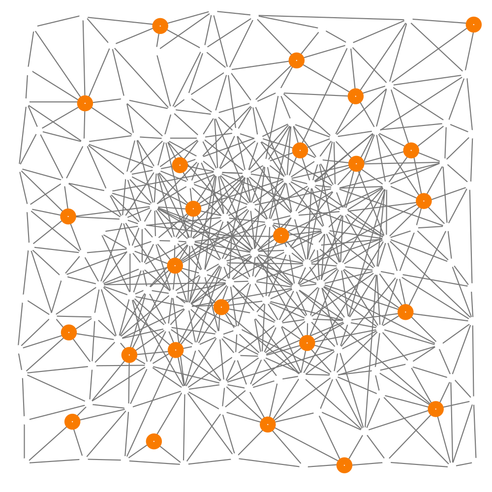
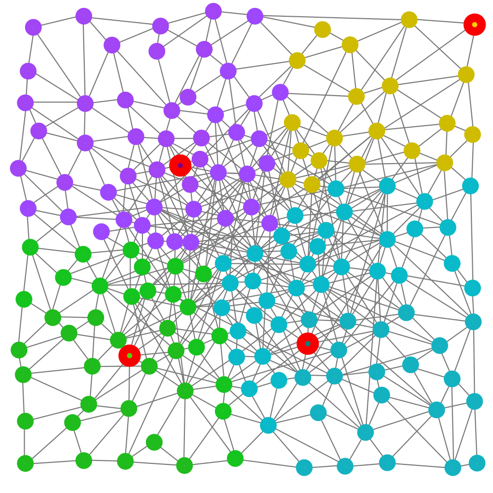
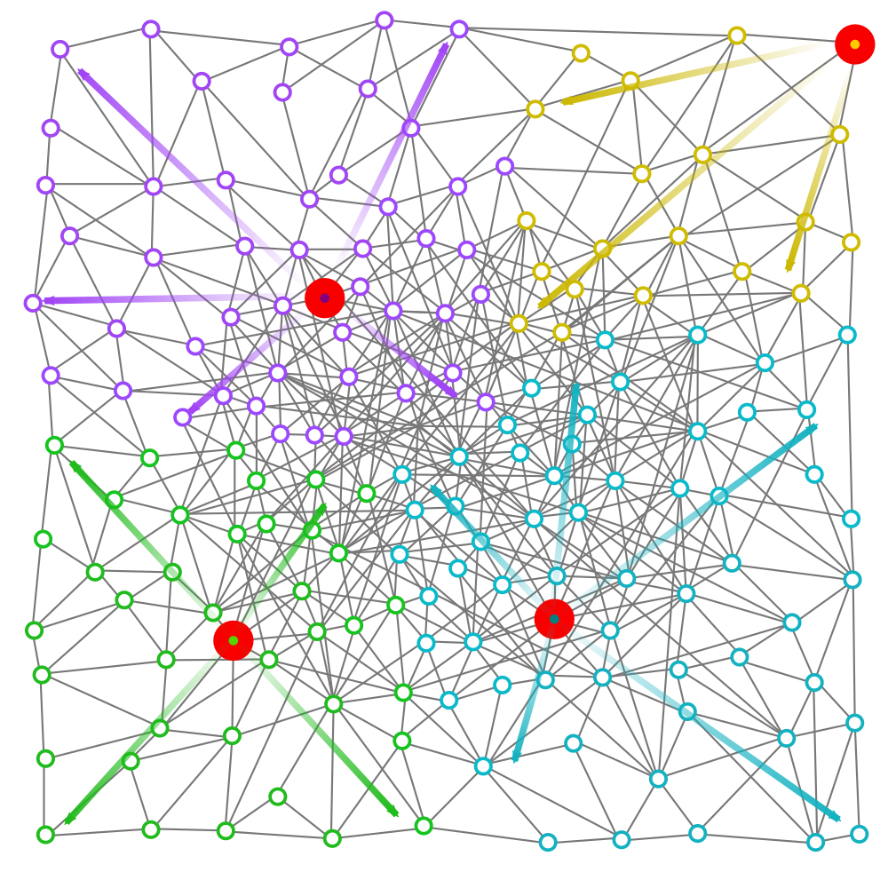

+++
title = "My presentation"
outputs = ["Reveal"]
+++

## [Self-organising Coordination Regions](https://danysk.github.io/Slides-2019-PSLab-SGCG/)
### [a Pattern for Edge Computing](https://danysk.github.io/Slides-2019-PSLab-SGCG/)

Roberto Casadei, __Danilo Pianini__,

Mirko Viroli, Antonio Natali

---



---



## Motivating case studies

[Metropolitan collaborative surveillance](https://doi.org/10.1002/spe.2586)

* Discovery and integration of smart cameras
* Multiple video streams to be fused and synchronized
* Object detection, tracking, analysis
* Processing can be on cloud, on fog, on edge

See paper by Dautov et al.

---



---



## Motivating case studies

[360° view multiplayer gaming](https://doi.org/10.1109/FMEC.2017.7946410)

* Multi-view (see what others are seeing)
* Augmented or Virtual Reality: free movement
* Delay intolerance
* Excessive bandwidth usage

---



## Problem and forces

* **heterogeneity**: *asymmetry among device capabilities*
* **locality**: *information is more valuable when is close to its source, moving it is expensive*
* **hybrid coordination**: *information aggregation is required, full centralization brings unacceptable costs*
* **dinamicity** *environment, network, and system structure changes at runtime*

---



## Well Known in literature?

* [Decentralised service orchestration](https://doi.org/10.1002/cpe.3655), Jaradat et al.
* [TCMote, a WSN middleware](https://doi.org/10.1109/ICW.2005.5), Diaz et al.
* [TS-Mid, tuple-based WSN middleware](https://doi.org/10.1109/WAINA.2008.244), Lima et al.
* [Leader-based swarm coordination](https://doi.org/10.1145/2157689.2157704), Walker et al.
* [Distributed sensing](https://doi.org/10.1007/978-3-030-00302-9_4), Casadei et al.
* [Self-stabilizing target counting](https://doi.org/10.1109/SASO.2017.10), Pianini et al.
* [Group management for target tracking](https://doi.org/10.1023/B:TELS.0000029041.37854.92), Liu et al.
* [Crowd tracking and steering](https://doi.org/10.1109/MC.2015.261), Beal et al.
* ...

---



## Self-organising coordination regions

General solution to a commonly occurring problem

<span class="fragment">
--> We discovered a [design pattern](https://en.wikipedia.org/wiki/Software_design_pattern)!
</span>

---



## Shared solution elements

<span class="fragment">
1. *Election of leaders* -- from a set of candidates
</span>

<span class="fragment">
2. *Formation of regions* -- by assigning each user to a single leader
</span>

<span class="fragment">
3. *Upstream information flow* -- from users to leaders
</span>

<span class="fragment">
4. *Downstream information flow* -- from leaders to users
</span>

---



#### 1 of 4 -- Leader election


(logical) network of devices

---



#### 1 of 4 -- Leader election



<span style="color: #f97b00;"> orange</span> devices are leader candidates

---



#### 1 of 4 -- Leader election


<span style="color: #f90000;"> red</span> devices are elected leaders

---



#### 2 of 4 -- Formation of regions



one color per region, one leader per region

---



#### 3 of 4 -- Upstream communication


from users to leaders

---



#### 4 of 4 -- Downstream communication



from leaders to users

---

{}



#### Self-organising coordination regions
### Dynamics


---


### Apply when...

* larger-than-local perspective, globality inconvenient
* Information is relevant in the proximity of its source
* Deployment is unknown or subject to changes
  * The software must be able to run on the cloud or on the edge depending on specific deployment or even runtime contingencies

---



### Not to be used when...

* decision making can be purely local
* decision making can be centralised
  * (single leader election is possible, but often inefficient)
* Deployment is well-known, network is static

---

{}



#### Implementation issues
### Leader Election

* *Consensus strategy* -- centralized or distributed?
* *Candidate selection* -- heterogeneity of devices and network
* *Dinamicity and adaptivity* -- select leaders statically, elect them once, elect them at time intervals, elect them continuously


---



#### Implementation issues
### Formation of regions and downstream

Similar issues, information flows from leader to users

* *Gossip* -- monotonic information
* *Time-replicated gossip* -- [from Coordination 2016](https://doi.org/10.1007/978-3-319-39519-7_12)
* *Gradient-cast* -- Different gradients, different performance

---



#### Implementation issues
### Upstream: accumulation

Tougher than downstream

* *Gossip* -- monotonic, requires idempotence, expensive
* *Time-replicated gossip* -- tackles monotonicity and idempotence, but even more expensive
* *Spanning-tree accumulation* -- Scalable but fragile
* *Multi-path techniques* -- Slower convergence, higher reliability

---



#### Implementation template

```scala
class SCR extends AggregateProgram
    with BlockG with BlockC with BlockS {
  def main = {
    // Field of leaders, with at least grain distance
    val leader = branch(isCandidate) { S(grain) } { false }
    // Gradient from leaders based on a given distance metric
    val potential = distanceTo(leader, metric)
    // gathers local values towards leaders by aggregation
    val convergeCast = C(potential, local, aggregationFun)
    // on leaders, takes a decision based on received data
    val decision = decisionMaking(leader, convergeCast)
    // broadcast decisions and take action
    val divergeCast = G(leader, metric, decision)
    localAction(divergeCast) }}
```
Written in [Scala](https://www.scala-lang.org/) with the [Scafi](https://scafi.github.io) DSL

[Aggregate programming](https://doi.org/10.1109/MC.2015.261) is a natural fit for SCR

---



#### Advanced implementations
### Feedback loops

Dynamic tuning and advanced adaptation

* e.g. load balacing by tuning each leader's region size according to on the amount of upstreamed data

Feedbacks introduce further complexity

* The system may oscillate
* Low-pass filtering often advisable
  * e.g. exponential backoff


---



## Case study

#### Video streaming collection

* Urban center (mid-sized Italian city)
* 200 edge servers, randomized grid deployment
* Dynamically selected set of edge servers as leaders (one every 200m)
* *Feedback system*: the more users stream content to an edge server, the more its served area shrinks
* After ten minutes, we suddenly turn off a percentage of the leaders, and see how the system reacts
* The [experiment is reproducible](https://bitbucket.org/danysk/experiment-2019-coordination-dynamic-orchestration/src/master/)

---



---



---



### Parameters / Symbols

| Parameter | Meaning |
|----------|:------:|
| α | exponential backoff parameter. lower values, smoother output |
| fb | `on` if feedback enabled, `off` otherwise |
| ρ |  probability for a leader to shut down |
| E | expected value / statistic mean |
| σ | standard deviation |
| Σ  | sum |

---



#### Feedback loop tuning


---



#### Resilience


---



#### Load balancing


---



#### Conclusion

* General solution to a commonly occurring problem
  * --> We discovered a [design pattern](https://en.wikipedia.org/wiki/Software_design_pattern)!

1. Elect leaders
2. Set up influence areas
3. Build downstream communication
4. Build upstream communication

* One possible implementation provided and evaluated in the aggregate computing framework
* Particularly relevant for mixed edge/cloud systems
